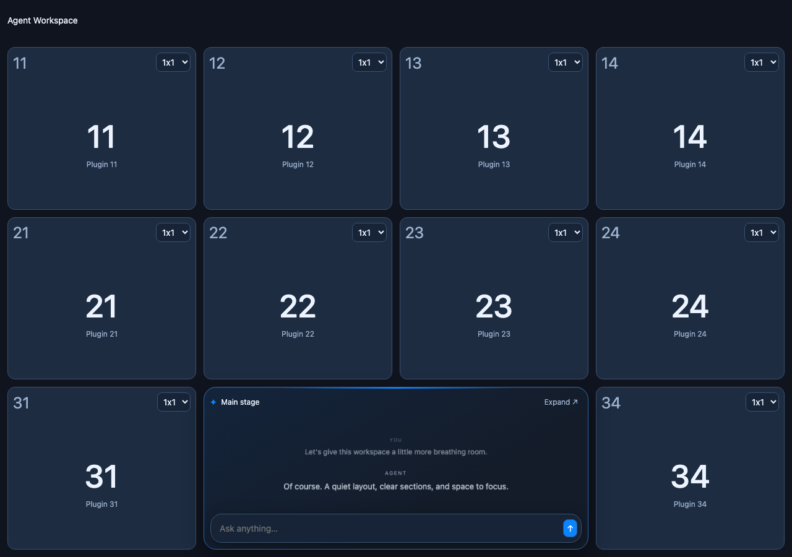
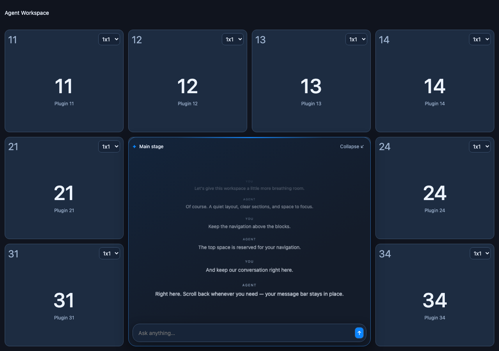
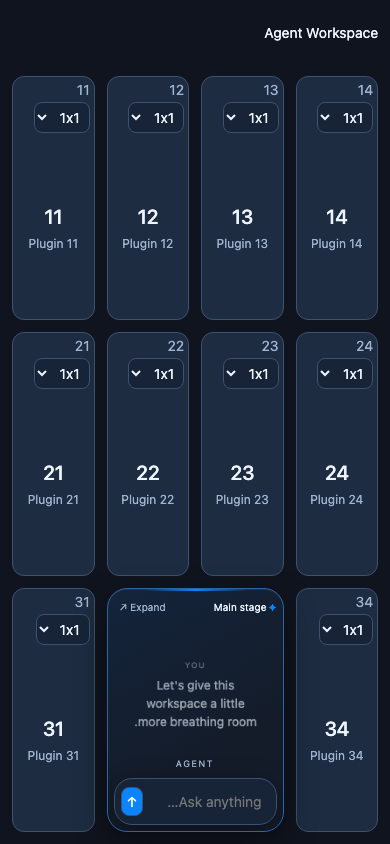

# Browser evidence

Captured by the isolated headless Chromium tests at 1280×900 (reference and expanded stage) and 390×844 (narrow RTL). These are demo palettes, not runtime defaults. CI produces fresh screenshots in its `browser-evidence` artifact.

See [validation evidence](pre-push/README.md#final-ci-color-threshold-correction) for the measured native/emulated amd64 rounding, the 0.003 per-pixel YIQ threshold with zero differing-pixel allowance, and the full 20-test functional suite plus 40 screenshot states.
